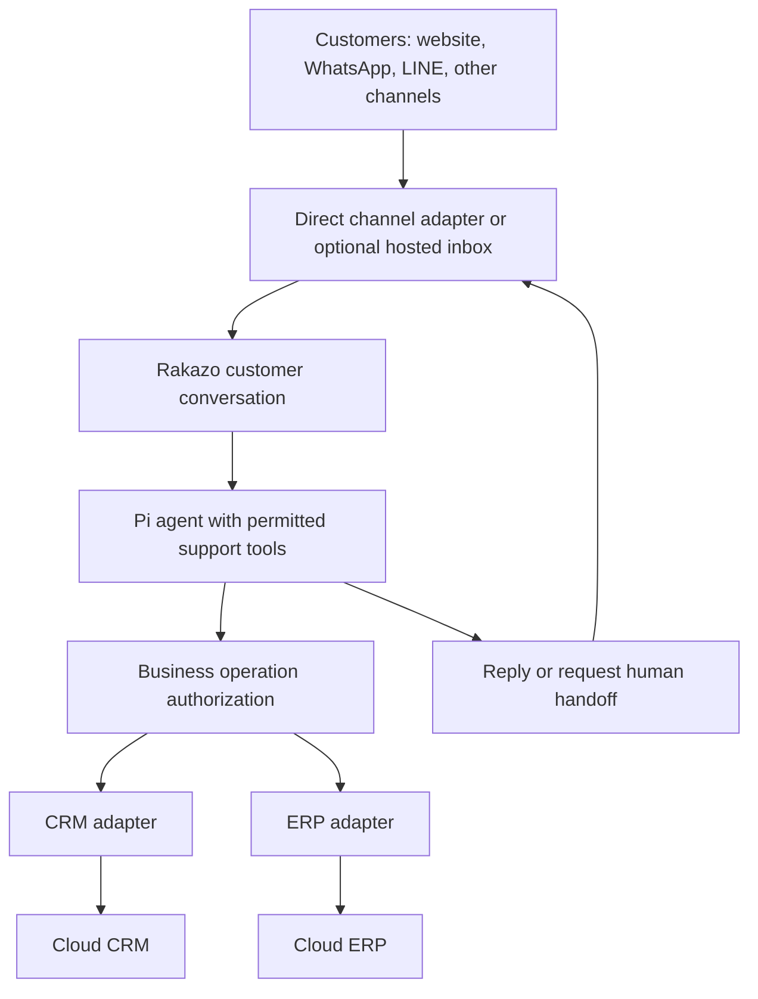

# Customer messaging and cloud CRM/ERP for Rakazo

Research date: 2026-09-10. Requirements: bots converse with external customers across several channels and use cloud-hosted CRM/ERP systems. No specific CRM, ERP, or messaging vendor is selected. Chatwoot is an example, not a requirement. Rakazo source snapshot: `2241538afc9276054c5e1be390891b7a59496394`. This is a research recommendation, not an implemented or live-tested integration.

## Recommendation

Keep Pi as the agent runtime. Add a customer-conversation mode that owns identity, conversation isolation, business permissions, and handoff. Connect messaging providers through replaceable adapters, and connect CRM/ERP systems through Rakazo's existing tool-provider boundary. For a fast launch across several channels with staff takeover, an optional hosted inbox such as Chatwoot is a practical first adapter. For a fully Rakazo-owned customer experience, build on the existing Chat SDK transport support and add the missing channels. Neither route requires changing the agent framework.

This recommendation follows two existing boundaries: `MessagingSurface` verifies incoming messages and sends replies; `ConnectorProvider` discovers and executes tools. They solve different problems. A connector's send-message action or an MCP server alone does not supply customer conversation routing, inbound delivery, or handoff. [Messaging contract](https://github.com/elie222/rakazo/blob/2241538afc9276054c5e1be390891b7a59496394/packages/adapter-kit/src/interfaces.ts#L317-L364), [tool-provider contract](https://github.com/elie222/rakazo/blob/2241538afc9276054c5e1be390891b7a59496394/packages/adapter-kit/src/interfaces.ts#L157-L190)

The diagram describes the proposed architecture. Provider-specific credentials, payloads, and rate-limit handling belong in adapters; customer permissions belong in Rakazo's backend.

## Messaging options

| Approach | What it supplies | What Rakazo must supply | Fit |
| --- | --- | --- | --- |
| Direct channels through Chat SDK and native provider APIs | Message transport, webhook parsing, provider-specific send operations | Customer routing, unsupported channel adapters, staff takeover, customer-facing history and UI | Best long-term control when the customer experience should live in Rakazo |
| Hosted support inbox, with Chatwoot as one candidate | Existing customer inbox and bot/human conversation workflow | Inbox-to-bot mapping, AgentBot integration, business tools, permission checks | Practical first route when several channels and a staff inbox are needed quickly |
| Managed communications APIs, with Twilio as one candidate | Hosted messaging infrastructure and SDK/API access | Customer UI or separate agent desktop, routing, handoff policy, CRM/ERP integration | Useful when managed transport is wanted without adopting a complete support inbox |

Chat SDK documents a common adapter interface for webhook verification, parsing, and sending. Its upstream web adapter supports a browser UI and requires the application to resolve the browser user's identity through `getUser`; it is not automatically an anonymous, authenticated customer portal. Twilio documents messaging conversations and a separate Flex agent experience. These are capability comparisons, not claims of drop-in Rakazo compatibility. [Chat SDK adapters](https://chat-sdk.dev/docs/platform-adapters), [web adapter](https://chat-sdk.dev/adapters/official/web), [Twilio Flex conversations](https://www.twilio.com/docs/flex/admin-guide/core-concepts/conversations)

Multi-channel support must retain channel capabilities. LINE documents signed webhooks, asynchronous processing, and duplicate detection using `webhookEventId`. WhatsApp has a customer-service window and template requirements for later outreach, documented by Twilio for its WhatsApp transport. Do not treat every channel as unrestricted `send(text)` or equate accepted delivery with a customer having read the message. [LINE inbound events](https://developers.line.biz/en/docs/messaging-api/receiving-messages/), [WhatsApp delivery-window error](https://www.twilio.com/docs/api/errors/63016)

### Chatwoot adapter example

Use an AgentBot to attach Rakazo to an existing Chatwoot inbox. Its pending conversations allow bot triage before human handoff. An API channel instead adds a custom customer transport or interface to Chatwoot. Create the bot through `POST /api/v1/accounts/{account_id}/agent_bots`, the account Application API. Application APIs support Cloud and self-hosted installations; the Platform API is unnecessary for this path. Confirm the chosen account's API and AgentBot entitlement. [AgentBot guide](https://www.chatwoot.com/hc/user-guide/articles/1677497472-how-to-use-agent-bots), [API channel guide](https://www.chatwoot.com/hc/user-guide/articles/1677839703-how-to-create-an-api-channel-inbox), [account bot API](https://developers.chatwoot.com/api-reference/account-agentbots/create-an-agent-bot), [API availability](https://developers.chatwoot.com/api-reference/introduction)

The adapter should process only `message_created` events with `message_type: incoming`, `private: false`, a configured account/inbox, and bot-controlled conversation state. The listener also forwards updates and outgoing message events, so this filtering prevents response loops. Recheck ownership before sending an answer after staff takeover. [AgentBot listener](https://github.com/chatwoot/chatwoot/blob/9d8d46a3aff90e5d1532e476617bfb8855300150/app/listeners/agent_bot_listener.rb#L36-L88), [message payload](https://github.com/chatwoot/chatwoot/blob/9d8d46a3aff90e5d1532e476617bfb8855300150/app/models/message.rb#L181-L198)

Verify `X-Chatwoot-Signature` against `sha256=HMAC-SHA256(secret, timestamp + "." + raw_body)`, using the timestamp header and constant-time comparison. Apply a replay window. Deduplicate delivery IDs and account/inbox/message IDs, persist the event, then acknowledge and run Pi asynchronously. Current source defaults to a five-second webhook timeout; do not hold the request open while the model runs. [Signature implementation](https://github.com/chatwoot/chatwoot/blob/9d8d46a3aff90e5d1532e476617bfb8855300150/lib/webhooks/trigger.rb#L54-L63), [verification guide](https://www.chatwoot.com/hc/user-guide/articles/1677693021-how-to-use-webhooks), [timeout](https://github.com/chatwoot/chatwoot/blob/9d8d46a3aff90e5d1532e476617bfb8855300150/lib/webhooks/trigger.rb#L118-L123)

Reply with `POST /api/v1/accounts/{account_id}/conversations/{conversation_id}/messages`, an `api_access_token` header, and `message_type: outgoing`, `private: false`. A staff-only summary uses `private: true`. Handoff uses `POST` to the same conversation's `/toggle_status` endpoint with `status: open`; optional `/assignments` selects staff or a team. Bot tokens explicitly support these operations. Rakazo still owns customer-record authorization and suppression of delayed replies after takeover. [Message API](https://developers.chatwoot.com/api-reference/messages/create-new-message), [status API](https://developers.chatwoot.com/api-reference/conversations/toggle-status), [bot permissions](https://github.com/chatwoot/chatwoot/blob/9d8d46a3aff90e5d1532e476617bfb8855300150/app/controllers/concerns/access_token_auth_helper.rb#L1-L7)

## What Rakazo already has, and the missing boundary

Rakazo currently configures WhatsApp, Slack, Telegram, Lark, and Sendblue through its Chat SDK surface. The inspected platform list does not register Chatwoot, LINE, or a web adapter. Platform credentials are composed at deployment scope, so multi-business channel-account configuration also needs deliberate design. [Platform composition](https://github.com/elie222/rakazo/blob/2241538afc9276054c5e1be390891b7a59496394/packages/adapters/src/messaging-platforms.ts#L1-L202), [Chat SDK surface](https://github.com/elie222/rakazo/blob/2241538afc9276054c5e1be390891b7a59496394/packages/adapters/src/chat-sdk-surface.ts#L25-L80)

The current direct-message path treats the sender as the owner of a personal bot. A linked sender reaches their bot; optional open signup provisions an account, space, and personal assistant. That is not the right relationship for a business's customers. A support contact should belong to an external customer conversation owned by the business, not acquire the authority of a Rakazo workspace member. [Inbound routing](https://github.com/elie222/rakazo/blob/2241538afc9276054c5e1be390891b7a59496394/apps/api/src/messaging-inbound.ts#L59-L170), [provisioning semantics](https://github.com/elie222/rakazo/blob/2241538afc9276054c5e1be390891b7a59496394/packages/db/src/messaging.ts#L35-L43)

Reuse existing `ExternalConversation` and `ExternalMessage` records as the starting point. They already store provider/workspace/conversation identity, separate conversation threads, event IDs, and delivery state. The personal bot thread is unique per bot; many customers must not share that thread or its conversation summary. Existing team-chat behavior still needs a support-specific review rather than being relabeled as customer support. [External records](https://github.com/elie222/rakazo/blob/2241538afc9276054c5e1be390891b7a59496394/packages/db/prisma/schema.prisma#L1218-L1273), [thread relationships](https://github.com/elie222/rakazo/blob/2241538afc9276054c5e1be390891b7a59496394/packages/db/prisma/schema.prisma#L445-L471)

Recommended additions are narrowly scoped:

- Bind each channel account/inbox to a business space and a support bot configuration. Use one execution history per customer conversation, even when many conversations share the same bot configuration.
- Resolve customer identity server-side. Link identities across channels only after verification; a display name or an email typed into chat is not sufficient proof of record ownership.
- Keep customer history and private customer memory separate. Share only approved business knowledge, such as published product information and support procedures.
- Track bot/human ownership of a conversation. A takeover must prevent a queued or in-flight bot answer from being sent after staff take control; resumption should be explicit.
- Deduplicate inbound events, serialize conflicting work within a conversation, and use an outbox for replies. Retry ambiguous sends according to the channel's idempotency contract, not a universal exactly-once assumption.
- Give support runs a narrow tool set. Internal notes, secrets, administrative tools, arbitrary shell access, and staff approval requests must never be mirrored into the customer reply stream.

These are proposed acceptance requirements. The existing messaging outbox is useful implementation material, but its automatic mirroring is designed around personal messaging runs and must be reviewed for customer-visible output. [Outbound mirroring](https://github.com/elie222/rakazo/blob/2241538afc9276054c5e1be390891b7a59496394/packages/adapters/src/messaging-delivery.ts#L34-L114)

## Provider-neutral cloud CRM and ERP

Use a small business-operation vocabulary, not a universal replica of every vendor's data model. For example, `get_customer_order`, `get_shipment_status`, `create_sales_enquiry`, and `create_quote_draft` describe useful support work. Add operations as workflows require them. Adapters map those operations to the selected provider, including custom fields, currencies, record IDs, and state transitions.

| Execution route | Use when | Limitation |
| --- | --- | --- |
| Official provider REST API or MCP server | It exposes the required operations and authentication | APIs, object models, and permission scopes still differ |
| Optional connector gateway such as OpenConnector | Its exact provider actions have been verified for the target workflow | Catalog size does not prove coverage, tenancy, or live compatibility |
| Explicit workflow exposed through MCP, such as n8n | A business operation requires a fixed sequence across systems | Another service to operate; workflow access is not customer-record authorization |

HubSpot is a concrete example of an official remote MCP interface: its documentation requires an MCP auth app and OAuth with PKCE, and operations inherit the connected HubSpot user's permissions. ERPNext/Frappe demonstrates the REST path with generated DocType endpoints and token authentication. These examples show different authentication/data models, not a recommendation to buy either product. [HubSpot remote MCP](https://developers.hubspot.com/docs/apps/developer-platform/build-apps/integrate-with-the-remote-hubspot-mcp-server), [Frappe REST API](https://docs.frappe.io/framework/user/en/api/rest)

The inspected OpenConnector revision includes HubSpot, ERPNext, and NetSuite provider definitions. That establishes declared integration implementations, not validation of the particular operations or cloud accounts a business needs. Keep it optional and apply the scoped-token requirements from the earlier [OpenConnector research](open-connector.md). n8n's MCP Server Trigger can expose explicitly connected tools and workflows over Streamable HTTP or SSE with bearer/header authentication; use that narrowly scoped endpoint rather than exposing workflow administration to a customer bot. [HubSpot definition](https://github.com/oomol-lab/open-connector/blob/4d7d59de1f6d474a1afb6194de008a0affc08b10/src/providers/hubspot/definition.ts#L1-L31), [ERPNext definition](https://github.com/oomol-lab/open-connector/blob/4d7d59de1f6d474a1afb6194de008a0affc08b10/src/providers/erpnext/definition.ts#L1-L44), [NetSuite definition](https://github.com/oomol-lab/open-connector/blob/4d7d59de1f6d474a1afb6194de008a0affc08b10/src/providers/netsuite/definition.ts#L1-L74), [n8n MCP Server Trigger](https://docs.n8n.io/integrations/builtin/core-nodes/n8n-nodes-langchain.mcptrigger)

The most important rule is that authenticating a business CRM account does not authorize a customer to see all that account's records. Rakazo's current `AdapterContext` carries user, space, and bot identity; installed tools are discovered by user and space. A customer support execution path must also bind verified customer identity and enforce record ownership in backend code. The model may request an order; the backend must decide whether that order belongs to the verified customer. Apply the same restriction to reads, not only writes. [Adapter context](https://github.com/elie222/rakazo/blob/2241538afc9276054c5e1be390891b7a59496394/packages/adapter-kit/src/types.ts#L3-L21), [installed tool scope](https://github.com/elie222/rakazo/blob/2241538afc9276054c5e1be390891b7a59496394/packages/adapters/src/installed-connectors.ts#L130-L149)

Begin with scoped reads and low-risk drafts. Configure explicit business authorization for cancellations, refunds, price changes, inventory changes, and finalized financial documents. Approval belongs to authorized staff or a defined business policy, not to an arbitrary customer answering yes. For cross-system writes, use stable operation IDs and reconciliation; a CRM update and ERP update are not a shared atomic transaction merely because an agent invokes both.

## Staged proof

1. Establish the customer execution boundary with synthetic conversations. Prove that customers cannot access one another's history, records, staff notes, or internal tools.
2. Connect two channels to the same support bot configuration, keeping conversations separate. Verify signed inbound events, duplicate handling, reply routing, and staff takeover during an in-flight response.
3. Add one scoped CRM lookup and one ERP order/shipment lookup. Use test tenants or disposable records before real customer access.
4. Add one explicit business write, such as creating a draft enquiry or quote, with replay-safe handling and auditable authorization.
5. Prove replacement by running the same business-operation conformance tests against a second adapter. Preserve provider-specific fields only where an actual workflow needs them.

No cloud accounts were connected, dependencies installed, deployments changed, or customer messages sent during this research. Runtime integration tests remain to be done. Exact channels, target vendor operations, hosted-plan availability, and permission requirements must be checked when a business chooses providers.

## Source verification

Run `python3 scripts/verify-customer-messaging-research.py` to check commit-pinned GitHub source availability and citation line bounds. It does not verify vendor documentation URLs, claim accuracy, or runtime compatibility. Official documentation was read separately; it may change after the research date.
